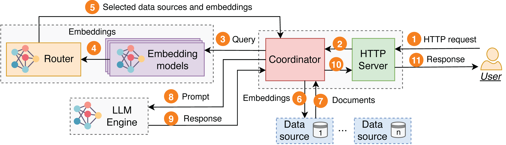

# RAGRoute

This repository contains the code for the paper **"Efficient Federated Search for Retrieval-Augmented Generation using Lightweight Routing"**. RAGRoute enables intelligent routing across federated data sources to improve retrieval-augmented generation (RAG) performance.

---

## System Architecture

<p align="center">
  
  <br/>
  <em>RAGRoute system architecture.</em>
</p>

The system processes a query by routing it to relevant data sources, retrieving documents in parallel, and using them to generate an answer with an LLM.

RAGRoute consists of the following components, each implemented as a separate process.

#### **Coordinator and HTTP Server**

At the core of RAGRoute is a main process containing a coordinator and an HTTP server.

- The HTTP server receives incoming requests from users and returns responses once the query is processed.
- When a request is received, the query is forwarded to the coordinator.
- The coordinator manages communication between the different components.

---

#### **Router**

The coordinator first forwards the query to the routing process (step 3).

- This process has the relevant embedding models loaded in memory and hosts the RAGRoute router model.
- After embedding generation, these embeddings are forwarded to the router model (step 4).
- The router outputs a list of relevant data sources.
- The identifiers of these data sources and the embeddings are returned to the coordinator (step 5).

---

#### **Data Sources**

Next, the coordinator sends the compatible embedding to each of the selected data sources in parallel.

- Each data source retrieves the top-*k*<sub>ret</sub> relevant documents.
- These documents are returned to the coordinator.

After receiving all responses:

- The coordinator reranks and filters the documents resulting in a final top-*k* list of relevant document chunks.

---

#### **LLM Engine**

Finally, the coordinator constructs the prompt sent to the LLM engine.

- The prompt contains:
  - The user query.
  - The retrieved documents.
- The LLM returns a response to the coordinator (step 9).
- The coordinator sends the final reply back to the user (step 10 and 11).

---

## Project Structure

- `main.py`: Launches the RAGRoute server and router logic.
- `run_benchmark.py`: Sends benchmark queries asynchronously to evaluate the system.
- `ragroute/`: Core logic including routing, HTTP server, LLM handling, data sources, and configuration.
- `data/`: Benchmark datasets, output files, and logs.

---

## Quickstart

### 1. Install Dependencies

Make sure you're using Python 3.8+ and run:

```bash
pip install -r requirements.txt
```

Also ensure [Ollama](https://ollama.com) is installed and running:

```bash
ollama serve
```

---

### 2. Start the RAGRoute Server

In a terminal:

```bash
python3 main.py --dataset <dataset> --routing <routing>
```

Arguments:
- `--dataset`: `medrag` or `feb4rag`
- `--routing`: `ragroute`, `random`, `all`, or `none`

Example:

```bash
python3 main.py --dataset feb4rag --routing ragroute
```

This will:
- Launch the HTTP server
- Initialize data source clients

Keep this terminal running.

---

### 3. Run the Benchmark Script

In a separate terminal, run:

```bash
python3 run_benchmark.py --benchmark <benchmark> --routing <routing> --parallel <n>
```

Arguments:
- `--benchmark`: `FeB4RAG` or `MIRAGE`
- `--routing`: Match the routing method from the server
- `--parallel`: Number of parallel queries (default: 1)

Example:

```bash
python3 run_benchmark.py --benchmark FeB4RAG --routing ragroute --parallel 1
```

---

## Benchmark Output

Benchmark results are saved to the `data/` folder:

- `benchmark_<benchmark>_<routing>.csv`: Per-query performance metrics
- `answers_<benchmark>_<routing>.jsonl`: Raw LLM responses
- `ds_stats_<benchmark>_<routing>.csv`: Data source latency and message sizes

---

## CLI Reference

### `main.py`
```bash
--dataset          Dataset to use (medrag or feb4rag)
--routing          Routing strategy (ragroute, random, all, none)
--disable-llm      Skip LLM call (only retrieval)
--simulate         Add artificial delay
--model            LLM model to use (must be in SUPPORTED_MODELS)
```

### `run_benchmark.py`
```bash
--benchmark        Benchmark name (FeB4RAG or MIRAGE)
--routing          Routing strategy used
--parallel         Number of concurrent queries to send
--questions        (Optional) Specific question set (e.g., medqa)
```

---

## Notes

- Ollama must be running in the background (`ollama serve`) before launching the server.
- Ensure ports required by the system (e.g., 8000, 5555–5560) are available.

---

## Extending

- Add new data sources in `ragroute/config.py`
- Create custom routing logic in `ragroute/router/`
- Add new benchmarks under `data/benchmark/`
- Customize reranking in `ragroute/rerank.py`

---

## Citation

If you use this code, please cite the associated paper.
